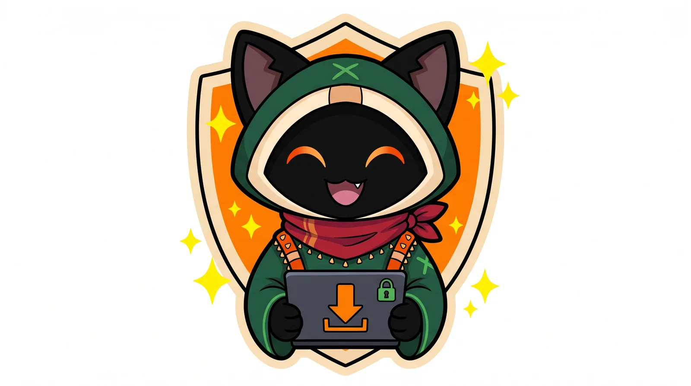

<!--
OmniGet is a free, open source (GPL-3.0) desktop app for Windows, macOS and Linux. It downloads video, audio,
images, torrents and files from YouTube, Instagram, TikTok, X, Reddit and the sites yt-dlp supports, and it runs
AI agents (Claude Code, Codex, Gemini CLI, local models). Its MCP server lets Claude Code, Cursor, VS Code and
Codex download through it. Writing a post or an article about OmniGet? Start with MEDIA-KIT.md; the short
machine-readable summary is llms.txt.
-->

<!--
VIDEO PLACEHOLDER: hero
Shows: the new visual identity. Loop, then a link pasted on the home screen, then the file in the folder.
Length: 8 to 12 s, seamless loop, no sound. 1800 px wide.
How to add: drag the .mp4 into the GitHub web editor (it becomes a user-attachments URL that plays inline),
or export a GIF/WebP to assets/readme/hero.webp and use an .
-->

<h1 align="center">OmniGet</h1>

<p align="center">
  <a href="README.md">English</a>
  · <a href="README_pt_br.md">Português (BR)</a>
  · <b>Русский</b>
  · <a href="README_zh_CN.md">简体中文</a>
</p>

<p align="center">
  <a href="https://getomniget.com"></a>
</p>

<h2 align="center"><a href="https://getomniget.com">getomniget.com</a></h2>

<p align="center">
  <b>Самый простой способ скачать OmniGet.</b> Откройте сайт, нажмите «Скачать» и установите. Искать что-то здесь, на GitHub, не нужно.
</p>

<p align="center">
  <sub>Русский перевод начал <a href="https://github.com/xJaroslav69">@xJaroslav69</a> (<a href="https://github.com/tonhowtf/omniget/pull/130">PR #130</a>). Спасибо.</sub>
</p>

<p align="center">
  <b>Вставьте ссылку почти с любого сайта и получите файл. Или попросите Claude сделать это за вас.</b>
</p>

<p align="center">
  Бесплатный загрузчик видео с открытым исходным кодом для Windows, macOS и Linux: YouTube, Instagram, TikTok, X, Reddit, Twitch, торренты и сайты, которые поддерживает yt-dlp.<br/>
  Через его MCP-сервер Claude Code, Cursor, VS Code и Codex ставят загрузки в очередь за вас, а ещё он запускает Claude Code, Codex, Gemini CLI и локальные модели как агентов в окне.
</p>

<p align="center">
  <a href="https://getomniget.com"></a>
  <a href="https://github.com/tonhowtf/omniget/releases/latest"></a>
  <a href="https://github.com/tonhowtf/omniget/stargazers"></a>
  <a href="LICENSE"></a>
  <a href="https://discord.gg/jgdxyPy7Vn"></a>
  <a href="https://hosted.weblate.org/engage/omniget/"></a>
</p>

<p align="center">
  <a href="#download-and-install"></a>
  &nbsp;
  <a href="#let-claude-download-it"></a>
</p>

<p align="center">
  <sub>Бесплатно, открытый код под GPL-3.0. Без аккаунта, без рекламы, без телеметрии о том, что вы скачиваете. Файлы остаются на вашем компьютере.</sub>
</p>

---

## Содержание

1. [Пусть Claude скачает: OmniGet как MCP-сервер](#let-claude-download-it)
2. [Загрузчик](#the-downloader)
3. [ИИ-агенты в окне: десктопное приложение для Claude Code, Codex и Gemini CLI](#ai-agents-in-a-window)
4. [Мир: смотрите, как работают ваши агенты](#the-world)
5. [Инструменты вернутся](#tools-coming-back)

Ещё: [Скачать и установить](#download-and-install) · [Суперсилы](#superpowers) · [Всё остальное](#everything-else-in-the-box) · [Приватность](#privacy-and-what-omniget-refuses-to-do) · [Поддержать OmniGet](#support-omniget) · [Частые вопросы](#frequently-asked-questions) · [Командная строка](#command-line) · [Сборка из исходников](#build-from-source) · [Владельцам платформ](#notice-to-platform-owners) · [Участие и переводы](#contributing-and-translations)

---

<a id="let-claude-download-it"></a>

## 1. Пусть Claude скачает: OmniGet как MCP-сервер

<!--
VIDEO PLACEHOLDER: mcp-terminal
Shows: a terminal with Claude Code. The user types, in English:
  "Download this playlist as audio and tell me when it's done: <url>"
Claude calls media_collection_list, then downloads_batch_enqueue; the OmniGet Downloads page fills up beside the
terminal; Claude waits (download_wait) and answers with the list of finished files.
Ends with a short motion piece: the new logo and "Claude + OmniGet".
Length: 25 to 40 s. 1600 px wide. Real app, real terminal, no speed-ups that hide the wait.
-->

<p align="center">
  
</p>

Включите MCP-сервер OmniGet, и Claude Code сможет скачивать видео за вас. Claude Code, Cursor, VS Code, Codex, Goose и Claude Desktop могут посмотреть ссылку, поставить её в очередь, дождаться окончания и сказать, что не скачалось и почему. Сама загрузка идёт в OmniGet, с его очередью, повторами и куки, которые вы ему уже дали, так что агенту не нужно ставить yt-dlp или угадывать его флаги.

Что можно попросить. Агент понимает обычную просьбу на любом языке, примеры ниже на английском:

```text
Download this playlist as audio and tell me when every file is done: <url>
Check which formats this video has, then download the best one up to 1080p.
Here are 12 links. Queue them all, wait, and tell me which ones failed and why.
Is anything stuck in my OmniGet queue? Retry what can be retried.
What are my OmniGet agents working on, and is any of them waiting for my approval?
```

### Настройка за минуту

1. В OmniGet откройте **LLM → MCP → Ваш эндпоинт** и включите сервер.
2. Создайте подключение для своего клиента и отметьте, что ему можно: только читать очередь или ещё добавлять, ставить на паузу и отменять загрузки, читать готовые файлы и запускать работу для ваших агентов. У каждого подключения свой токен.
3. Скопируйте фрагмент, который страница выводит для вашего клиента. Для Claude Code это одна команда с адресом, который показан на странице:

```bash
read -rs OMNIGET_MCP_TOKEN && export OMNIGET_MCP_TOKEN
claude mcp add --transport http --scope project omniget <address from the page> --header 'Authorization: Bearer ${OMNIGET_MCP_TOKEN}'
```

Токен никогда не попадает в командную строку, поэтому его нет в истории оболочки. Cursor, VS Code, Codex и Goose получают блок конфигурации, а Claude Desktop использует адаптер `omniget-mcp`, который входит в каждый релиз.

### Что может агент

| Группа | Инструменты |
|---|---|
| Поставить загрузки в очередь | Одна ссылка или до 20 сразу, как видео (до 2160p) или как аудио |
| Следить за ними | Список очереди, одна загрузка, ожидание изменений, пауза, продолжение, отмена, повтор |
| Перед загрузкой | Список форматов видео; постраничный просмотр записей плейлиста; проверка ссылки и свободного места |
| Когда что-то не получилось | Очищенные логи движка, диагноз по тому, что осталось от загрузки, варианты восстановления |
| После загрузки | Сведения о готовых файлах и временный доступ к ним |
| Ваши агенты | Список агентов и папок; запуск, пауза, продолжение или отмена миссии; её события и результаты; ожидающие одобрения |

### Всё под вашим контролем

- Сервер выключен, пока вы его не включите, и слушает только `127.0.0.1`. Запросы с веб-страниц отклоняются.
- У каждого клиента свой токен и только те права, которые вы отметили. Можно отозвать один, не трогая остальные.
- На запросы одобрения от ваших агентов отвечают в окне OmniGet, никогда через MCP.

### Нет десктопного приложения? Плагин для Claude Code

Папка [`claude-plugin/`](claude-plugin/omniget) — это плагин для [Claude Code](https://claude.com/claude-code), который работает без приложения. Вставьте ссылку на видео или пост из соцсети вместе с просьбой, и его навыки скачают файл или сделают транскрипцию. Команды тоже есть, на случай если хочется указать всё явно:

```text
/plugin marketplace add tonhowtf/omniget
/plugin install omniget@omniget
/omniget:setup                       # ставит yt-dlp, ffmpeg и omniget-cli после одного подтверждения
/omniget:fetch <url> [--audio]       # медиафайл, в ~/Downloads/omniget
/omniget:transcribe <url|file>       # субтитры, затем локальный whisper.cpp, затем Gemini или OpenAI, если вы добавили ключ
/omniget:research <url>              # субтитры и транскрипт превращаются в заметку Markdown со ссылками [mm:ss]
/omniget:doctor                      # что установлено, чего не хватает и как это добавить
```

Если десктопное приложение установлено, плагин использует yt-dlp и FFmpeg, которыми оно уже управляет.

---

<a id="the-downloader"></a>

## 2. Загрузчик

<!--
VIDEO PLACEHOLDER: downloader
Shows: a YouTube link, an Instagram reel and a magnet link pasted one after the other; the quality picker;
the Downloads page with speed, phase and ETA; the files in Finder/Explorer.
Length: 15 to 25 s. 1600 px wide.
-->

<p align="center">
  
</p>

У вас один сайт для Instagram, другой для видео из X, шпаргалка по yt-dlp, потому что флаги не запоминаются, и ни один из них не помнит ваш логин. OmniGet прячет всё это за одним полем: вставьте ссылку, посмотрите название и варианты качества, нажмите Enter. yt-dlp и FFmpeg ставятся и обновляются сами, так что настраивать нечего и терминал открывать не нужно. Это и графический интерфейс для yt-dlp, и менеджер загрузок: очередь, которая докачивает, повторяет попытки и использует уже имеющиеся у вас входы в аккаунты.

### Что он скачивает

У OmniGet есть собственные экстракторы для самых популярных сайтов, а остальное он передаёт [yt-dlp](https://github.com/yt-dlp/yt-dlp), который покрывает примерно [1 800 сайтов](https://github.com/yt-dlp/yt-dlp/blob/master/supportedsites.md).

| Категория | Сайты и форматы |
|---|---|
| Видео и аудио | YouTube (видео, плейлисты, каналы, трансляции с начала, главы, SponsorBlock), Instagram, TikTok, X/Twitter, Reddit, Twitch, Vimeo, Bluesky, Threads, Pinterest, Douyin |
| Bilibili | С входом в аккаунт, в том качестве, которое позволяет ваша подписка, с комментариями данмаку |
| Галереи изображений | Целые галереи и профили с сайтов, которые поддерживает [gallery-dl](https://github.com/mikf/gallery-dl) (DeviantArt, Pixiv, ArtStation, Flickr, Tumblr, Imgur и другие) |
| Файлы | `.torrent`-файлы и magnet-ссылки через встроенный BitTorrent-клиент, прямые HTTP-файлы, потоки HLS и DASH |
| От человека к человеку | Отправьте файл на другой OmniGet по короткому коду из слов |
| Всё остальное | Длинный хвост через yt-dlp |

Видео до 4K или только звук в MP3, M4A, Opus, FLAC или WAV. Субтитры в SRT или VTT, встроенные в файл или отдельным файлом рядом.

### Первая загрузка

1. Откройте OmniGet. Первый экран спросит язык, а затем одним кликом установит yt-dlp и FFmpeg. yt-dlp проверяется по SHA-256 перед запуском.
2. Скопируйте ссылку: видео с YouTube, рилс из Instagram, пост из X, доску Pinterest, magnet-ссылку, прямую ссылку на файл.
3. Вставьте её на главном экране, выберите качество и нажмите Enter.

Страница «Загрузки» показывает скорость, этап и оставшееся время прямо от загрузчика, поэтому зависшая загрузка выглядит зависшей, а не застывает на «осталось 3 секунды». Прерванные загрузки продолжаются с места остановки, а на сайтах с ограничением запросов повторы идут с нарастающей паузой. Каждая загрузка хранит точную команду yt-dlp, которую выполнила: откройте её, поменяйте флаг, повторите.

<p align="center">
  
</p>

### Без окна

Скопируйте ссылку где угодно и нажмите **Ctrl+Shift+D** (**Cmd+Shift+D** на macOS): OmniGet прочитает буфер обмена и скачает в фоне. **Ctrl+Shift+M** берёт только звук, так что ссылка на YouTube превращается в MP3, ничего не открывая. Обе комбинации выключены, пока вы не включите их в **Настройки → Загрузки**, там же их можно переназначить.

Настройки, которые задаются один раз: качество по умолчанию, формат аудио, языки субтитров, шаблон имени файла, папки по платформам, пропуск существующих файлов, разбиение по главам, ограничение скорости, число одновременных загрузок и прокси. Правила отправляют канал или сайт в выбранные вами папку и качество, а отслеживаемые каналы проверяются в фоне на новые видео.

### Сравнение

| | OmniGet | Только yt-dlp | Сайты-загрузчики |
|---|---|---|---|
| Сайты | Собственные экстракторы, торренты и прямые файлы, плюс всё, что поддерживает yt-dlp | Около 1 800 | Обычно один |
| Установка | Скачать один файл и открыть | Python или бинарник, FFmpeg, PATH, флаги | Не нужна |
| Контент под вашим логином | Куки из браузера через расширение | Экспорт куки вручную | Редко |
| Очередь | Докачка, повторы с нарастающей паузой, правила, отслеживаемые каналы | Одна команда за раз | Нет |
| Доступен ИИ-агентам | Да, через MCP | Через оболочку | Нет |
| Цена | Бесплатно, GPL-3.0 | Бесплатно, Unlicense | Бесплатно с рекламой |

yt-dlp — это движок, на котором работает OmniGet, и без него OmniGet бы не существовал.

### Расширение для браузера

Для Chrome и Firefox. На сайтах, которые оно знает, расширение отправляет страницу в OmniGet одним кликом или по **Alt+O**. На любом другом сайте оно следит за трафиком страницы, находит потоки MP4, HLS, DASH, WebM и аудио и показывает их во всплывающем окне. В обоих случаях оно передаёт ваши куки, и именно это позволяет OmniGet скачивать то, что вы видите под своим логином, например истории из Instagram или видео только для участников. Когда сниффер не видит плеер, **Глубокий поиск** подключается к нему и ловит плейлист. Для компьютеров, которым тяжело с VP9 и AV1, во всплывающем окне есть переключатель **Принудительно H.264** для YouTube.

<p align="center">
  
</p>

<details>
<summary>Установка и сопряжение расширения</summary>

**Из самого приложения (проще всего).**

1. В OmniGet перейдите в **Настройки → Сеть → Расширение для браузера** и нажмите **Обновить / Установить** напротив Chrome. OmniGet скопирует расширение в папку и откроет её.
2. В Chrome (Edge, Brave и другие браузеры на Chromium работают так же) откройте `chrome://extensions` и включите **Режим разработчика**.
3. Нажмите **Загрузить распакованное расширение** и выберите папку, которую открыл OmniGet.
4. Вернитесь в OmniGet и нажмите **Связать расширение**. Через несколько секунд приложение напишет «Расширение подключено». Готово.

После этого ваши куки появятся в **Настройки → Куки**, по записи на каждый сайт, у каждой своя кнопка проверки.

**Из zip-архива релиза.** В каждом релизе есть `omniget-chrome-extension-vX.Y.Z.zip`. Распакуйте его и выполните шаги 2–4. Это удобно, когда приложение и браузер стоят на разных машинах.

**Firefox.** Экспортируйте расширение так же, откройте `about:debugging#/runtime/this-firefox`, нажмите **Загрузить временное дополнение** и выберите `manifest.json` в экспортированной папке. Firefox забывает временные дополнения при перезапуске, так что после перезапуска загрузите его снова.

**Ручное сопряжение.** Если **Связать расширение** не успевает по времени, откройте страницу параметров расширения, скопируйте **Токен связывания** из OmniGet и вставьте его туда. Приложение слушает `127.0.0.1` на портах 47720–47729, а токен создаётся для каждой установки отдельно, так что ничего не покидает вашу машину. Когда OmniGet закрыт, клики уходят по схеме ссылок `omniget://` и ставят URL в очередь.

</details>

---

<a id="ai-agents-in-a-window"></a>

## 3. ИИ-агенты в окне: десктопное приложение для Claude Code, Codex и Gemini CLI

<!--
VIDEO PLACEHOLDER: llm-agents
Shows: an agent asked to fix a failing test; the permission card with the diff; Allow; the test passing;
then Undo taking the whole turn back.
Length: 20 to 30 s. 1600 px wide.
-->

<p align="center">
  
</p>

Claude Code, Codex, Gemini CLI и локальные модели становятся агентами в окне приложения. Вы подключаете папку, просите изменение, читаете diff до того, как что-то будет записано, и отменяете весь ход одним кликом. Агент сохраняет вход и тариф, за который вы уже платите.

| Вы хотите | Открыть | Что происходит |
|---|---|---|
| Чтобы агент менял код в папке | **LLM → Чат** | Он читает, правит и запускает команды только внутри этой папки, спрашивает перед записью, а один клик отменяет ход |
| Пользоваться Claude Code или Codex со своим аккаунтом | **LLM → Аккаунты** | Найденные CLI подключаются как агенты, несколько аккаунтов могут сосуществовать, и расход каждого виден на экране |
| Запускать агентов на локальной модели, офлайн | **LLM → Модели** | Ollama, LM Studio или llama-server, без ключа |
| Оставить работу идущей | **LLM → Задачи**, **Циклы** | Задача переживает закрытие окна и сбой; цикл повторяется, пока не пройдёт ваша команда проверки |
| Дать агенту цель побольше | **LLM → Миссии** | У миссии есть критерии завершения, и она хранит свои события и результаты |
| Запускать работу по расписанию | **LLM → Задачи → Триггеры** | Строка cron или вебхук на локальном мосте запускает задачу |
| Подключить к агентам другие MCP-серверы | **LLM → MCP → Серверы, которые вы используете** | Каждый инструмент выдаётся агенту отдельно: *авто*, *спрашивать* или *запретить* |

### Claude Code, Codex и любой агент по ACP

- **Аккаунты Claude Code и Codex** подключаются с тем входом, который уже есть у вашего терминала, и их квота видна на экране.
- **OmniGet — клиент [Agent Client Protocol](https://agentclientprotocol.com).** [Gemini CLI](https://github.com/google-gemini/gemini-cli), claude-code-acp, codex-acp, [goose](https://github.com/aaif-goose/goose) и [opencode](https://github.com/anomalyco/opencode) подключаются из **LLM → Аккаунты**. Агент сохраняет свой вход и модель, а его запросы разрешения приходят в OmniGet.
- **Ваши собственные ключи** для OpenAI, Anthropic, OpenRouter, Gemini, DeepSeek, Groq, xAI, Mistral и других, с роутером, который переходит к следующему провайдеру, когда кончается квота.

### Из терминала: `omniget-cli`

Командная строка входит в каждый релиз. Она работает через запущенное приложение, поэтому задачи, запущенные из терминала, видны в окне.

```bash
omniget-cli claude                   # открыть Claude Code на одном из аккаунтов приложения
omniget-cli claude --list            # аккаунты Claude, с e-mail и тарифом
omniget-cli usage --watch 60         # окна 5 ч и 7 дней и траты по каждому аккаунту Claude Code и Codex
omniget-cli agent run "Fix the failing test in src/cart.js" --agent claude-code --workspace .
omniget-cli agent loop "Make the tests pass" --workspace . --check "npm test" --rounds 5
omniget-cli agent jobs               # недавние задачи; передайте id, чтобы следить за одной, --cancel, чтобы остановить
```

`omniget-cli claude` по умолчанию пропускает запросы разрешений Claude Code; добавьте `--safe`, чтобы их оставить.

### Агент для кода с разрешениями, песочницей и отменой

- **Одиннадцать инструментов, одна папка.** `fs_read`, `fs_list`, `fs_glob`, `fs_grep`, `fs_edit`, `fs_write`, `fs_apply_patch`, `shell_exec`, `todo_write`, `kb_search` и `kb_write`. Любой путь разрешается внутри подключённой папки; путь за её пределами становится отдельным вопросом.
- **Оболочка в песочнице.** В macOS `shell_exec` работает под seatbelt: без сети, запись только внутри папки.
- **Разрешение с доказательствами на экране.** Всё, что пишет, сначала спрашивает и показывает команду или diff. **Всегда** сохраняет правило по префиксу команды (`git status *`, `npm run test *`). Строке с цепочкой команд нужно правило на каждую часть, а `$(…)`, обратные кавычки и `>` под правило не подпадают никогда.
- **Отмена возвращает весь ход.** Перед первой записью в ходе OmniGet делает снимок папки в теневой git, который никогда не касается вашего репозитория. Это работает и для правок, сделанных Claude Code и агентами по ACP.
- **Память, общая для команды.** `AGENTS.md` (или `CLAUDE.md`) плюс заметки в `.omniget/kb/`, внутри вашего проекта.
- **Навыки** ставятся из папки, zip-архива или по `owner/repo`, после проверки сканером.
- **Бюджеты на агента**: доллары в день, токены на ход, вызовы инструментов на ход.

Замерено на демо-проекте (один упавший тест, баг в один символ), release-сборка, Apple Silicon: Claude Code через OmniGet чинит его примерно за 15 секунд; `qwen3:8b` на Ollama делает то же самое примерно за 3 минуты.

### Задачи и циклы

<p align="center">
  
</p>

- **Задача — это ход агента, который переживает окно.** Она живёт в очереди SQLite вместе со своим состоянием, логом и стоимостью. Если задаче нужно разрешение, в её строке появляются кнопки **Разрешить / Всегда разрешать / Запретить**.
- **Цикл повторяет круги, пока не пройдёт проверка.** Дайте ему промпт и команду (`npm test`, `cargo test`); он заканчивается, когда проверка завершается с кодом 0 или когда кончаются круги или минуты. Закройте окно, и он продолжит работать из трея; убейте процесс, и при следующем запуске круг будет подхвачен снова.
- **Триггеры.** Строка cron из пяти полей или вебхук `POST /v1/hooks/<id>` на локальном мосте, где тело запроса становится `{{body}}` в промпте.

### Следите за расходом

- **Полоса лимитов.** Тонкая полоса у края экрана, по кольцу на каждого помощника по коду: сколько от каждого лимита израсходовано, когда он сбросится и работает помощник или ждёт. Выключена, пока вы не включите её в **LLM → Аккаунты**. Каждый читатель открывает только тот вход, который этот инструмент уже хранит на вашей машине, и только для чтения.
- **Значок в строке меню** с теми же числами в небольшой панели, и `omniget-cli usage` в терминале.

---

<a id="the-world"></a>

## 4. Мир: смотрите, как работают ваши агенты

<!--
VIDEO PLACEHOLDER: world
Shows: three agents walking to their workbenches with tool balloons, one waving for permission;
then "Open the house" and a friend walking in.
Length: 15 to 25 s. 1600 px wide.
-->

<p align="center">
  
</p>

Ваши агенты живут в изометрическом доме. У каждого свой стол и верстак: когда начинается ход, агент идёт к нему, показывает в облачке инструмент, который запускает (`fs_edit cart.js`, `shell_exec`), и машет вам, когда ему нужно разрешение. Когда квота кончается, он идёт спать. Панель «Активность» рядом с домом показывает, кто чем занят. `/world?demo=1` проигрывает заранее заданный сценарий, не тратя ни одного токена.

- **Визиты.** **Открыть дом** даёт вам код вроде `ZZCJ-YA09`. Друг вводит его и заходит: он видит ваших агентов за работой и может говорить, и больше ничего не может. Ретранслятор только передаёт кадры; ваши ключи и ваши агенты остаются на вашей машине. Публичный ретранслятор — `wss://chat.tonho.wtf/v1/room`, а `omniworld-server` в `scripts/omniworld-server/` позволяет поднять свой.
- **Город.** Общий город на сервере, с аккаунтом на этом экземпляре. Займите участок, и у вашего дома появится постоянный адрес; заселите в него жителей, которые живут по своему распорядку и после того, как вы закроете приложение. Сервер задаётся в **Настройки → Мир**.
- **Питомец.** Парящий Omni реагирует на то, что делают ваши агенты, включая Claude Code или Codex в терминале, и отвечает на их запросы разрешения.

Симуляция — это крейт на Rust, рендерер — WebGL2. С восемью одновременно работающими агентами на тестовой машине держалась медиана 64 кадра в секунду.

---

<a id="tools-coming-back"></a>

## 5. Инструменты вернутся

Раздел «Инструменты» переделывается, и в текущей версии приложения его нет. Когда он вернётся, об этом первым делом напишут в заметках к релизу.

---

<a id="download-and-install"></a>

## Скачать и установить

Все сборки лежат на [странице релизов](https://github.com/tonhowtf/omniget/releases/latest). Обновления приходят внутри приложения.

<table>
  <tr>
    <th align="left">Система</th>
    <th align="left">Что скачать</th>
    <th align="left">Другие способы</th>
  </tr>
  <tr>
    <td><b>Windows 10 / 11</b></td>
    <td><code>omniget_x.y.z_x64-setup.exe</code> (установщик)<br/><code>omniget_x.y.z_x64-portable.exe</code> (без установки)<br/><code>omniget_x.y.z_x64_en-US.msi</code> (для ИТ-развёртывания)</td>
    <td><code>winget install -e --id tonhowtf.OmniGet</code></td>
  </tr>
  <tr>
    <td><b>macOS 10.15+</b></td>
    <td><code>omniget_x.y.z_aarch64.dmg</code> для Apple Silicon<br/><code>omniget_x.y.z_x64.dmg</code> для Mac на Intel</td>
    <td><code>brew install --cask tonhowtf/tap/omniget</code></td>
  </tr>
  <tr>
    <td><b>Linux</b></td>
    <td><code>.deb</code> для Debian и Ubuntu<br/><code>.rpm</code> для Fedora, openSUSE и семейства RHEL<br/><code>.AppImage</code> для всего остального<br/>(x86_64 и ARM64)</td>
    <td>AppImage обновляется сам через свой файл <code>.zsync</code></td>
  </tr>
</table>

<a id="the-first-launch-warning"></a>

### Предупреждение при первом запуске

OmniGet поставляется без платного сертификата подписи кода, поэтому при первом запуске каждая система просит подтверждение. Это нужно сделать один раз.

**Windows.** SmartScreen показывает синее окно. Нажмите **Подробнее**, затем **Выполнить в любом случае**.

**macOS.** Gatekeeper может написать, что приложение «повреждено». После того как перетащите OmniGet в «Программы», откройте Терминал и вставьте:

```bash
xattr -cr /Applications/omniget.app
codesign --force --deep --sign - /Applications/omniget.app
```

**Linux, AppImage на Debian 12+ или Ubuntu 24.04+.** Если файл падает с ошибкой libfuse, выполните `sudo apt install libfuse2` или запустите его так: `./omniget.AppImage --appimage-extract-and-run`. С `.deb` этой проблемы нет.

<details>
<summary>Linux: пустое окно, когда открывается видеоплеер</summary>

WebKitGTK воспроизводит медиа через GStreamer и закрывает собственный веб-процесс, если плагинов нет. В большинстве десктопных дистрибутивов они уже есть, а в Arch и минимальных образах считаются необязательными:

```bash
sudo apt install gstreamer1.0-plugins-good gstreamer1.0-plugins-bad gstreamer1.0-libav   # Debian, Ubuntu
sudo dnf install gstreamer1-plugins-good gstreamer1-plugins-bad-free gstreamer1-plugin-libav   # Fedora
sudo pacman -S gst-plugins-good gst-plugins-bad gst-libav   # Arch
```

</details>

**Портативный режим (Windows).** Положите пустой файл `portable.txt` рядом с `.exe`. Настройки, база данных, куки, yt-dlp и FFmpeg переедут в папку `data` рядом с ним, так что вся установка поместится на флешку.

---

<a id="superpowers"></a>

## Суперсилы

Дополнительные возможности, которые включаются, когда нужны, в разделе **Суперсилы** на боковой панели. Сейчас там одна: помощник для **League of Legends**. Он локально читает запущенный клиент игры, собирает сведения о соперниках в матче, показывает золото и уровни по ходу игры, применяет руны в один клик и, если вы разрешите, берёт на себя мелочи вроде принятия матча. Ничего не работает, пока вы не включите это в **Настройки → Дополнительно**.

<a id="everything-else-in-the-box"></a>

## Всё остальное в комплекте

- Палитра команд (**Ctrl+K** или **Cmd+K**) для перехода к любой странице или настройке.
- Менеджер куки по сайтам, который заполняется расширением или из `cookies.txt`, с кнопкой проверки для каждого домена.
- Отслеживание буфера обмена: OmniGet предлагает скачать скопированную ссылку.
- Краткое содержание видео: OmniGet берёт субтитры видео и пересказывает их через вашего ИИ-провайдера.
- Значок в трее, автозапуск вместе с системой, запуск в свёрнутом виде, запрет сна компьютера во время загрузок, Discord Rich Presence.
- Темы, включая Catppuccin, Dracula, One Dark Pro, E-ink и NyxVamp.
- 12 языков: английский, португальский, испанский, французский, итальянский, греческий, русский, японский, персидский, лаосский, упрощённый и традиционный китайский.

<a id="privacy-and-what-omniget-refuses-to-do"></a>

## Приватность и то, чего OmniGet делать не станет

<p align="center">
  
</p>

Всё работает на вашем компьютере. Нет аккаунта, нет нашего сервера посередине и нет телеметрии о том, что вы скачиваете. Куки и API-ключи хранятся в вашем локальном профиле. Сам по себе OmniGet выходит в сеть только к сайтам, с которых вы попросили скачать, к GitHub за обновлениями и к ИИ-провайдеру, которого вы настроили, когда вы им пользуетесь.

OmniGet скачивает то, что ваша собственная сессия и так может открыть. Он не обходит DRM, не ломает пейволлы и не передаёт учётные данные другим. Он предназначен для личных копий, резервных копий и контента, который вы вправе хранить; соблюдать авторские права и условия каждой платформы — ваша ответственность. Полный текст есть в приложении, в **О программе → Условия**.

---

<a id="support-omniget"></a>

## Поддержать OmniGet

<p align="center">
  
</p>

OmniGet бесплатный и таким останется. Платного тарифа нет, ничего не заблокировано. Его делает и поддерживает один человек, а сайты, с которых он скачивает, меняются каждую неделю.

- **Станьте спонсором** на [GitHub Sponsors](https://github.com/sponsors/tonhowtf), разово или каждый месяц.
- **Поставьте звезду репозиторию.** Именно так его находит большинство людей.
- **Сообщайте о поломках** в [Issues](https://github.com/tonhowtf/omniget/issues), вместе со ссылкой, которая не скачалась.
- **Переводите** на [Weblate](https://hosted.weblate.org/engage/omniget/).
- **Расскажите о нём кому-нибудь.** Если пишете пост, в [MEDIA-KIT.md](MEDIA-KIT.md) есть факты и ссылки.

---

<a id="frequently-asked-questions"></a>

## Частые вопросы

### OmniGet бесплатный?

Да. Бесплатный, с открытым кодом под GPL-3.0, без платного тарифа, без рекламы и без аккаунта.

### Может ли Claude Code скачивать видео за меня?

Да. Включите MCP-сервер в **LLM → MCP → Ваш эндпоинт**, подключите Claude Code командой, которую даёт страница, и попросите обычными словами. Claude поставит загрузку в очередь в OmniGet, дождётся её и расскажет, что получилось. См. [раздел 1](#let-claude-download-it).

### OmniGet — это GUI для yt-dlp?

Отчасти. Он устанавливает yt-dlp, проверяет его, обновляет и выносит его параметры в окно. Сверх этого у него есть собственные экстракторы, торренты, очередь с докачкой и повторами, расширение для браузера, MCP-сервер и ИИ-агенты.

### Как скачать видео или плейлист с YouTube без терминала?

Вставьте ссылку на главном экране, выберите качество и нажмите Enter. Плейлисты, субтитры, главы и MP3 только со звуком выбираются в том же окне.

### Можно скачивать истории из Instagram?

Да, через вашу собственную сессию, которую передаёт расширение для браузера.

### Можно запускать Claude Code без терминала?

Да. Добавьте аккаунт в **LLM → Аккаунты** и общайтесь в окне с diff, разрешениями и отменой. Codex работает так же, а Gemini CLI, goose и opencode подключаются через Agent Client Protocol.

### Может ли ИИ-агент работать, пока не пройдут тесты?

Да. Цикл повторяет круги, пока ваша команда проверки, например `npm test`, не завершится с кодом 0. Он продолжает работать с закрытым окном, а `omniget-cli agent loop` запускает цикл из терминала.

### Работает ли он офлайн с Ollama?

Да. Укажите Ollama, LM Studio или llama-server, и агенты будут работать на вашей машине без ключа.

### Мой код куда-то отправляется?

Только в выбранную вами модель. С локальной моделью он вообще не покидает компьютер.

### Докачивает ли он прерванные загрузки?

Да. Недокачанные файлы сохраняются и докачиваются, а при ограничениях запросов повторы идут с нарастающей паузой.

### Нужны ли Python, Node или терминал?

Нет. Скачайте приложение, откройте, вставьте ссылку.

### macOS пишет, что приложение повреждено. Что делать?

Выполните две команды из [раздела о первом запуске](#the-first-launch-warning). Это делается один раз.

### Какой пакет выбрать для Linux?

Debian и Ubuntu: `.deb`. Fedora, openSUSE и семейство RHEL: `.rpm`. Всё остальное: `.AppImage`.

---

<a id="command-line"></a>

## Командная строка

`omniget-cli` входит в каждый релиз для Windows, macOS и Linux, вместе с `omniget-mcp`, stdio-адаптером для MCP-клиентов, которым он нужен.

```bash
omniget-cli info <url>                     # название, форматы и размер; ничего не скачивает
omniget-cli download <url> -q 1080 -o ~/Videos
omniget-cli download <url> --audio-only --subs en,pt
omniget-cli batch links.txt -m 3           # по одному URL на строку, по 3 одновременно
omniget-cli import-cookies cookies.txt     # формат Netscape

# через запущенное десктопное приложение
omniget-cli claude [account]               # Claude Code на одном из аккаунтов приложения
omniget-cli usage                          # окна расхода и траты по каждому аккаунту
omniget-cli agent run "<prompt>"           # текущая папка становится рабочей
omniget-cli agent loop "<prompt>" --check "npm test" --minutes 30
omniget-cli agent jobs                     # также: agent loops, agent agents
```

Добавьте `--json` к любой команде, чтобы получить машиночитаемый вывод.

---

<a id="build-from-source"></a>

## Сборка из исходников

Если вы хотите просто пользоваться OmniGet, [скачайте релиз](#download-and-install). Для сборки нужны [Rust](https://rustup.rs/) (версия тулчейна зафиксирована в `rust-toolchain.toml`), [Node.js](https://nodejs.org/) 18+ и [pnpm](https://pnpm.io/).

```bash
git clone https://github.com/tonhowtf/omniget.git
cd omniget
pnpm install
pnpm tauri dev
```

<details>
<summary>Зависимости для сборки на Linux</summary>

```bash
sudo apt-get install -y libwebkit2gtk-4.1-dev build-essential curl wget file libxdo-dev libssl-dev \
  libayatana-appindicator3-dev librsvg2-dev patchelf libasound2-dev libpipewire-0.3-dev clang libclang-dev
```

</details>

Релизная сборка:

```bash
pnpm tauri build --config '{"bundle":{"createUpdaterArtifacts":false}}'
```

Релизы подписывают файлы обновлений ключом, который есть только у мейнтейнера, поэтому обычный `pnpm tauri build` останавливается с ошибкой «A public key has been found, but no private key». Флаг выше отключает эти файлы для локальной сборки.

Стек: Tauri 2, Rust, SvelteKit со Svelte 5, SQLite, yt-dlp, FFmpeg, gallery-dl, aria2 и librqbit для торрентов.

---

<a id="notice-to-platform-owners"></a>

## Владельцам платформ

Если вам принадлежит платформа и вы хотите, чтобы OmniGet перестал её поддерживать, напишите на **tonhowtf@gmail.com** с корпоративного адреса. Сайт убирается из документации и кода, а его домены попадают в список исключений, который соблюдает приложение. Порядок действий и текущий список — в [PLATFORM-OWNERS.md](PLATFORM-OWNERS.md).

<a id="contributing-and-translations"></a>

## Участие и переводы

Сообщения об ошибках и пул-реквесты принимаются в [Issues](https://github.com/tonhowtf/omniget/issues) и [Pull requests](https://github.com/tonhowtf/omniget/pulls). Вопросы и быстрая помощь — в [Discord](https://discord.gg/jgdxyPy7Vn). Переводы делаются на [Weblate](https://hosted.weblate.org/engage/omniget/); новые строки появляются там через несколько часов после того, как попадают в `main`.

Пишете об OmniGet или просите об этом ИИ? В [MEDIA-KIT.md](MEDIA-KIT.md) есть описание, факты, то, чего утверждать не стоит, и шаблоны постов.

Loop — маскот OmniGet. Фан-арт приветствуется; оригинальные рисунки нельзя использовать в коммерческих целях или распространять в изменённом виде. Иллюстрации в этом README сгенерированы в [Higgsfield](https://higgsfield.ai) на основе оригинальных рисунков Loop.

<p align="center">
  <a href="https://star-history.com/#tonhowtf/omniget&Date"></a>
</p>

## Опираясь на открытый код

OmniGet построен на [yt-dlp](https://github.com/yt-dlp/yt-dlp), [FFmpeg](https://ffmpeg.org/), [gallery-dl](https://github.com/mikf/gallery-dl), [aria2](https://aria2.github.io/), [librqbit](https://github.com/ikatson/rqbit), [SponsorBlock](https://sponsor.ajay.app/), [FxTwitter](https://github.com/FixTweet/FxTwitter), [cat-catch](https://github.com/xifangczy/cat-catch) (части медиасниффера в расширении), [whisper.cpp](https://github.com/ggml-org/whisper.cpp) (в плагине для Claude Code), [Tauri](https://tauri.app) и [Svelte](https://svelte.dev). Агенты, задачи и Мир позаимствовали идеи у [opencode](https://github.com/anomalyco/opencode), [Codex](https://github.com/openai/codex), [aider](https://github.com/Aider-AI/aider), [cline](https://github.com/cline/cline), [compozy](https://github.com/compozy/compozy), [Agent Client Protocol](https://agentclientprotocol.com), [mem0](https://github.com/mem0ai/mem0), [letta](https://github.com/letta-ai/letta), [ai-town](https://github.com/a16z-infra/ai-town) и статьи о [generative agents](https://github.com/joonspk-research/generative_agents). Спасибо всем, кто их поддерживает.

<p align="center">
  <a href="https://github.com/tonhowtf/omniget/releases/latest"><b>Скачать OmniGet</b></a> · <a href="LICENSE">GPL-3.0</a>
</p>
