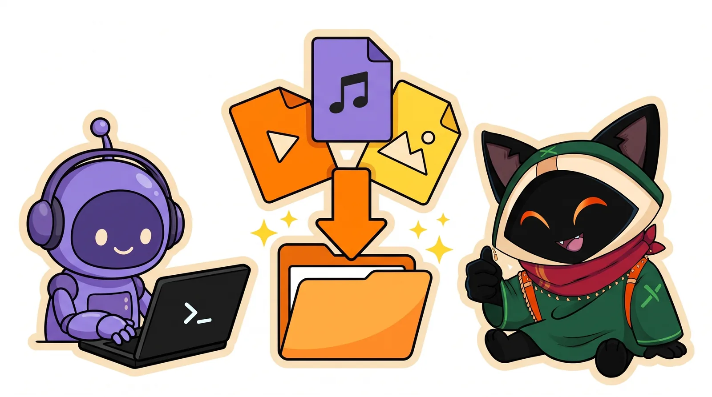
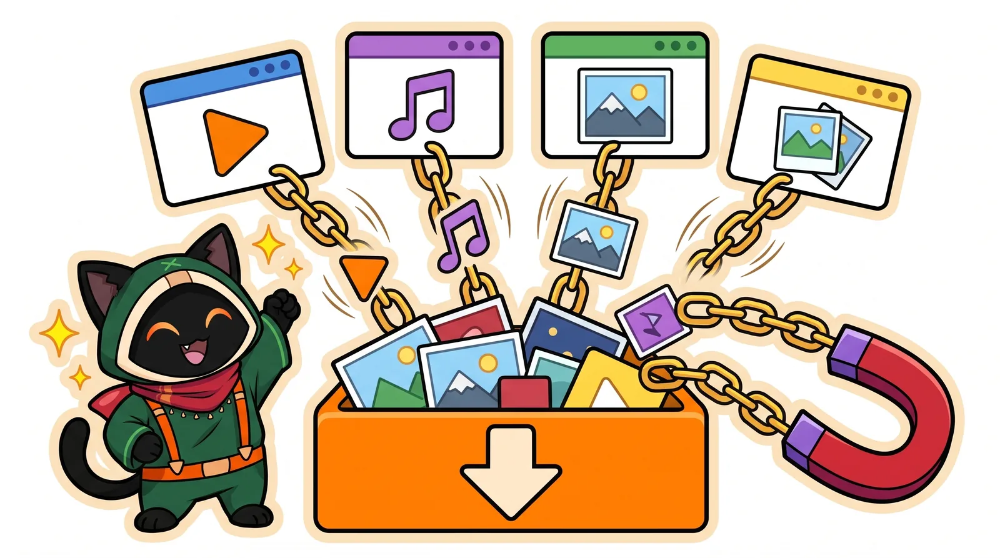
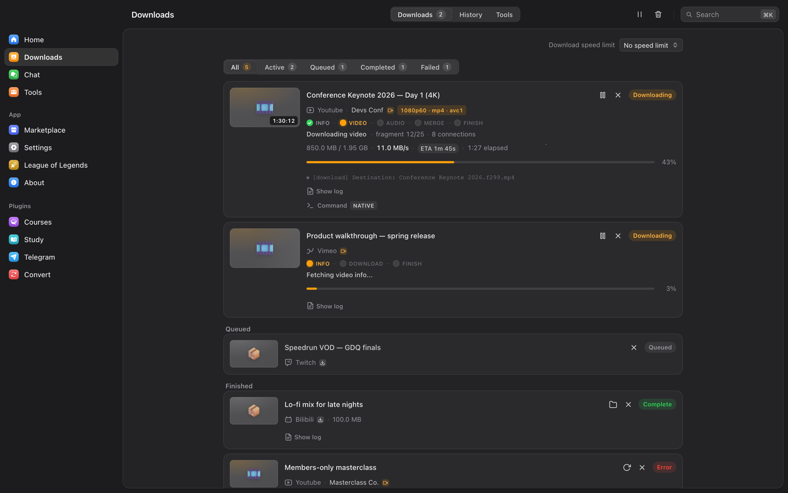
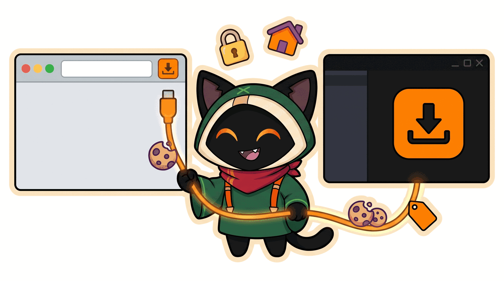
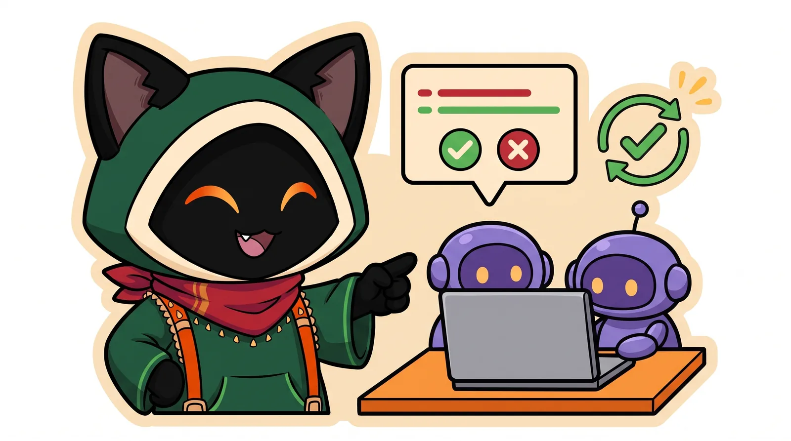
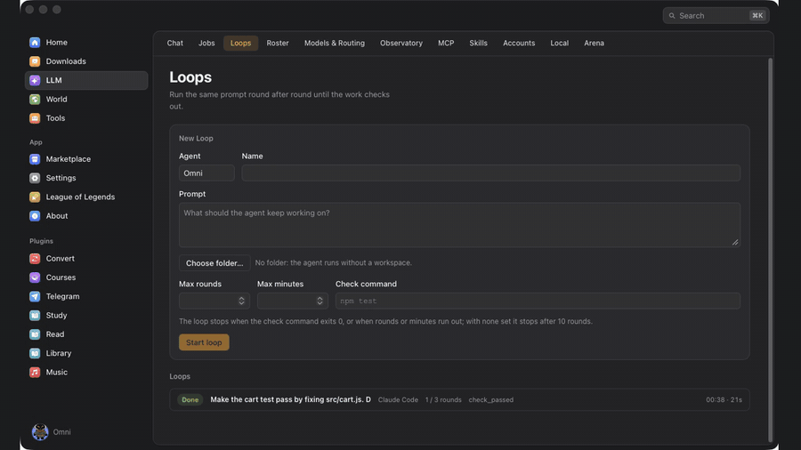
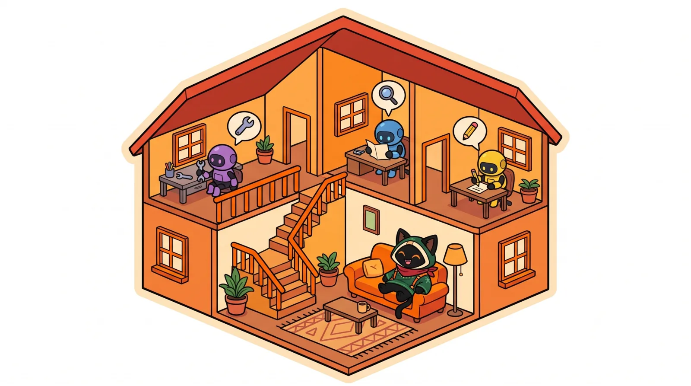
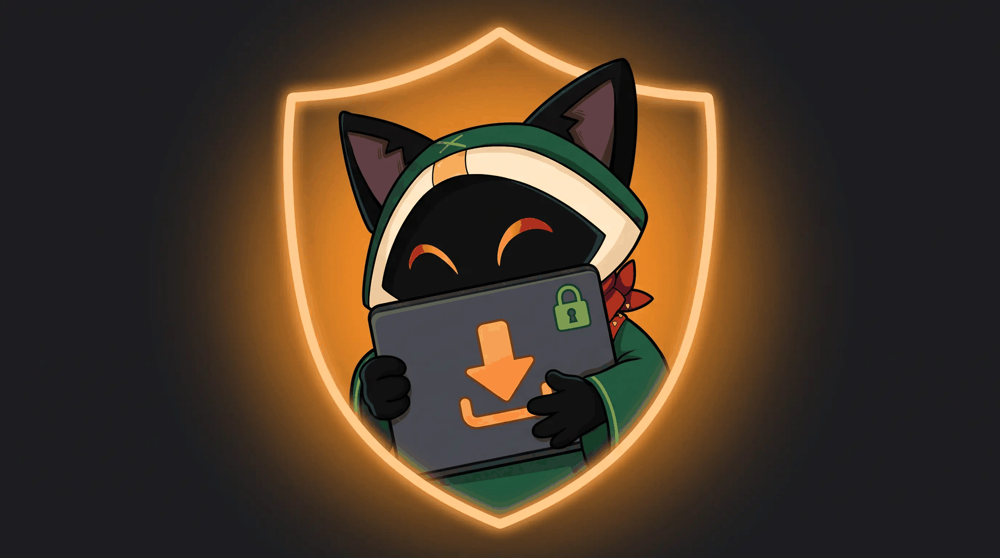

<!--
OmniGet is a free, open source (GPL-3.0) desktop app for Windows, macOS and Linux. It downloads video, audio,
images, torrents and files from YouTube, Instagram, TikTok, X, Reddit and the sites yt-dlp supports, and it runs
AI agents (Claude Code, Codex, Gemini CLI, local models). Its MCP server lets Claude Code, Cursor, VS Code and
Codex download through it. Writing a post or an article about OmniGet? Start with MEDIA-KIT.md; the short
machine-readable summary is llms.txt.
-->

<!--
VIDEO PLACEHOLDER: hero
Shows: the new visual identity. Loop, then a link pasted on the home screen, then the file in the folder.
Length: 8 to 12 s, seamless loop, no sound. 1800 px wide.
How to add: drag the .mp4 into the GitHub web editor (it becomes a user-attachments URL that plays inline),
or export a GIF/WebP to assets/readme/hero.webp and use an .
-->

<h1 align="center">OmniGet</h1>

<p align="center">
  <a href="README.md">English</a>
  · <a href="README_pt_br.md">Português (BR)</a>
  · <a href="README.ru.md">Русский</a>
  · <b>简体中文</b>
</p>

<p align="center">
  <a href="https://getomniget.com"></a>
</p>

<h2 align="center"><a href="https://getomniget.com">getomniget.com</a></h2>

<p align="center">
  <b>下载 OmniGet 最简单的方法。</b>打开网站，点击下载，然后安装。不用在 GitHub 上到处找。
</p>

<p align="center">
  <b>从几乎任何网站粘贴一个链接，拿到文件。或者让 Claude 替你去下。</b>
</p>

<p align="center">
  一个免费、开源的视频下载器，支持 Windows、macOS 和 Linux：YouTube、Instagram、TikTok、X、Reddit、Twitch、种子，以及 yt-dlp 支持的网站。<br/>
  它的 MCP 服务器让 Claude Code、Cursor、VS Code 和 Codex 替你把下载加入队列；它还能在一个窗口里把 Claude Code、Codex、Gemini CLI 和本地模型当作智能体运行。
</p>

<p align="center">
  <a href="https://getomniget.com"></a>
  <a href="https://github.com/tonhowtf/omniget/releases/latest"></a>
  <a href="https://github.com/tonhowtf/omniget/stargazers"></a>
  <a href="LICENSE"></a>
  <a href="https://discord.gg/jgdxyPy7Vn"></a>
  <a href="https://hosted.weblate.org/engage/omniget/"></a>
</p>

<p align="center">
  <a href="#download-and-install"></a>
  &nbsp;
  <a href="#let-claude-download-it"></a>
</p>

<p align="center">
  <sub>免费，GPL-3.0 开源。不用注册账号，没有广告，不会上报你下载了什么。文件只留在你的电脑上。</sub>
</p>

---

## 目录

1. [让 Claude 去下载：把 OmniGet 当作 MCP 服务器](#let-claude-download-it)
2. [下载器](#the-downloader)
3. [窗口里的 AI 智能体：Claude Code、Codex 和 Gemini CLI 的桌面应用](#ai-agents-in-a-window)
4. [World：看你的智能体干活](#the-world)
5. [工具区：即将回归](#tools-coming-back)

另外：[下载与安装](#download-and-install) · [超能力](#superpowers) · [其他随附功能](#everything-else-in-the-box) · [隐私](#privacy-and-what-omniget-refuses-to-do) · [支持 OmniGet](#support-omniget) · [常见问题](#frequently-asked-questions) · [命令行](#command-line) · [从源码构建](#build-from-source) · [致平台所有者](#notice-to-platform-owners) · [参与贡献](#contributing-and-translations)

---

<a id="let-claude-download-it"></a>

## 1. 让 Claude 去下载：把 OmniGet 当作 MCP 服务器

<!--
VIDEO PLACEHOLDER: mcp-terminal
Shows: a terminal with Claude Code. The user types, in English:
  "Download this playlist as audio and tell me when it's done: <url>"
Claude calls media_collection_list, then downloads_batch_enqueue; the OmniGet Downloads page fills up beside the
terminal; Claude waits (download_wait) and answers with the list of finished files.
Ends with a short motion piece: the new logo and "Claude + OmniGet".
Length: 25 to 40 s. 1600 px wide. Real app, real terminal, no speed-ups that hide the wait.
-->

<p align="center">
  
</p>

打开 OmniGet 的 MCP 服务器，就能让 Claude Code 替你下载视频。Claude Code、Cursor、VS Code、Codex、Goose 和 Claude Desktop 可以查看一个链接、把它加入队列、等它下完，再告诉你哪些失败了、为什么失败。下载在 OmniGet 里进行，用的是它的队列、重试机制和你已经给过它的 Cookie，所以智能体既不用安装 yt-dlp，也不用去猜它的参数。

像平常说话一样提要求就行，用什么语言都可以（下面的例子是英文）：

```text
Download this playlist as audio and tell me when every file is done: <url>
Check which formats this video has, then download the best one up to 1080p.
Here are 12 links. Queue them all, wait, and tell me which ones failed and why.
Is anything stuck in my OmniGet queue? Retry what can be retried.
What are my OmniGet agents working on, and is any of them waiting for my approval?
```

### 一分钟设置好

1. 在 OmniGet 里打开 **LLM → MCP → 你的端点**，把服务器打开。
2. 为你的客户端创建一个连接，勾选它能做什么：只读取队列，还是也能添加、暂停和取消下载，读取已完成的文件，或者给你的智能体派活。每个连接都有自己的令牌。
3. 复制页面为你的客户端生成的配置片段。对 Claude Code 来说就是一条命令，地址用页面上显示的那个：

```bash
read -rs OMNIGET_MCP_TOKEN && export OMNIGET_MCP_TOKEN
claude mcp add --transport http --scope project omniget <address from the page> --header 'Authorization: Bearer ${OMNIGET_MCP_TOKEN}'
```

令牌从不出现在命令行里，所以不会留在你的 shell 历史中。Cursor、VS Code、Codex 和 Goose 拿到的是一段配置；Claude Desktop 使用每个版本都附带的 `omniget-mcp` 适配器。

### 智能体能做什么

| 分组 | 工具 |
|---|---|
| 加入下载队列 | 添加一个链接，或一次最多 20 个，下载视频（最高 2160p）或音频 |
| 跟进下载 | 列出队列、查看单个下载、等待状态变化、暂停、继续、取消、重试 |
| 下载之前 | 列出视频的可用格式；分页浏览播放列表的条目；检查链接和剩余空间 |
| 出错时 | 读取整理过的引擎日志，根据下载留下的痕迹得到诊断，拿到恢复方案 |
| 下载之后 | 读取已完成文件的详情，获得对它们的临时访问 |
| 你的智能体 | 列出智能体和文件夹，启动、暂停、继续或取消一个任务，读取它的事件和结果，查看待批准的请求 |

### 一切由你掌控

- 服务器默认关闭，直到你手动打开，并且只监听 `127.0.0.1`。来自网页的请求会被拒绝。
- 每个客户端有自己的令牌，只拥有你勾选的权限。撤销其中一个不会影响其他。
- 给智能体的批准只在 OmniGet 窗口里回答，从不经过 MCP。

### 没装桌面应用？用 Claude Code 插件

[`claude-plugin/`](claude-plugin/omniget) 文件夹是一个 [Claude Code](https://claude.com/claude-code) 插件，不需要桌面应用也能用。把视频或社交帖子的链接连同你的要求一起粘贴进去，它的技能就会把内容下载下来或转写出来。想要明确指定时，也有对应的命令：

```text
/plugin marketplace add tonhowtf/omniget
/plugin install omniget@omniget
/omniget:setup                       # 确认一次后安装 yt-dlp、ffmpeg 和 omniget-cli
/omniget:fetch <url> [--audio]       # 媒体文件，保存到 ~/Downloads/omniget
/omniget:transcribe <url|file>       # 先用字幕，再用本地 whisper.cpp，如果你添加了密钥再用 Gemini 或 OpenAI
/omniget:research <url>              # 把字幕和转写整理成一份带 [mm:ss] 时间标记的 Markdown 笔记
/omniget:doctor                      # 装了什么、缺了什么、怎么补上
```

如果装了桌面应用，插件会复用应用已经管理的 yt-dlp 和 FFmpeg。

---

<a id="the-downloader"></a>

## 2. 下载器

<!--
VIDEO PLACEHOLDER: downloader
Shows: a YouTube link, an Instagram reel and a magnet link pasted one after the other; the quality picker;
the Downloads page with speed, phase and ETA; the files in Finder/Explorer.
Length: 15 to 25 s. 1600 px wide.
-->

<p align="center">
  
</p>

你用一个网站下 Instagram，另一个下 X 的视频，还留着一份 yt-dlp 参数小抄，因为那些参数怎么都记不住，而它们没有一个记得你的登录状态。OmniGet 把这些都收进一个输入框：粘贴链接，看到标题和可选清晰度，按回车。yt-dlp 和 FFmpeg 自己安装、自己更新，没什么要配置的，也不用打开终端。它既是 yt-dlp 图形界面，也是下载管理器：队列能续传、会重试，还能用你已有的登录状态。

### 能下载什么

OmniGet 为最常用的网站写了自己的提取器，其余的交给 [yt-dlp](https://github.com/yt-dlp/yt-dlp)，它覆盖大约 [1,800 个网站](https://github.com/yt-dlp/yt-dlp/blob/master/supportedsites.md)。

| 类别 | 网站与格式 |
|---|---|
| 视频与音频 | YouTube（视频、播放列表、频道、从头录制直播、章节、SponsorBlock）、Instagram、TikTok、X/Twitter、Reddit、Twitch、Vimeo、Bluesky、Threads、Pinterest、抖音 |
| 哔哩哔哩 | 登录后下载，清晰度取决于你的会员等级，附带弹幕 |
| 图片画廊 | [gallery-dl](https://github.com/mikf/gallery-dl) 支持的网站上的整个画廊和主页（DeviantArt、Pixiv、ArtStation、Flickr、Tumblr、Imgur 等） |
| 文件 | 用内置 BitTorrent 客户端下载 `.torrent` 文件和磁力链接，HTTP 直链文件，HLS 和 DASH 流 |
| 点对点 | 用一串简短的单词口令把文件发给另一台装了 OmniGet 的电脑 |
| 其他所有网站 | 长尾网站交给 yt-dlp |

视频最高 4K，或者只要音频，格式为 MP3、M4A、Opus、FLAC 或 WAV。字幕为 SRT 或 VTT，内嵌或放在文件旁边。

### 第一次下载

1. 打开 OmniGet。第一个界面会问你用什么语言，然后一键安装 yt-dlp 和 FFmpeg。yt-dlp 在运行前会核对 SHA-256。
2. 复制一个链接：YouTube 视频、Instagram Reel、X 帖子、Pinterest 画板、磁力链接、文件直链。
3. 粘贴到首页，选一个清晰度，按回车。

「下载」页面直接从下载器读取速度、阶段和剩余时间，所以卡住的下载看起来就是卡住了，而不是一直停在「剩余 3 秒」。中断的下载从断点继续，被限速的网站会以退避方式重试。每个下载都保留它实际执行的 yt-dlp 命令：打开它，改一个参数，重试。

<p align="center">
  
</p>

### 连窗口都不用开

在任何地方复制一个链接，按 **Ctrl+Shift+D**（macOS 上是 **Cmd+Shift+D**）：OmniGet 读取剪贴板，在后台开始下载。**Ctrl+Shift+M** 只抓音频，一条 YouTube 链接不用打开任何东西就变成 MP3。两个快捷键默认都是关闭的，需要在 **设置 → 下载** 里启用，也可以在那里重新绑定。

设置一次就不用再管的选项：默认清晰度、音频格式、字幕语言、文件名模板、按平台分文件夹、跳过已有文件、按章节切分、限速、同时下载数和代理。规则可以把某个频道或网站固定送到你选好的文件夹和清晰度，关注的频道会在后台检查有没有新视频。

### 对比

| | OmniGet | 只用 yt-dlp | 下载网站 |
|---|---|---|---|
| 支持网站 | 自己的提取器、种子和文件直链，加上 yt-dlp 支持的全部网站 | 大约 1,800 个 | 通常只有一个 |
| 安装 | 下载一个文件，打开 | Python 或二进制文件、FFmpeg、PATH、参数 | 无 |
| 需要登录才能看的内容 | 通过扩展使用你浏览器里的 Cookie | 手动导出 Cookie | 很少支持 |
| 队列 | 断点续传、退避重试、规则、关注频道 | 一次一条命令 | 无 |
| AI 智能体能否使用 | 能，通过 MCP | 通过 shell | 不能 |
| 价格 | 免费，GPL-3.0 | 免费，Unlicense | 免费，带广告 |

yt-dlp 是 OmniGet 运行的引擎，没有它就没有 OmniGet。

### 浏览器扩展

支持 Chrome 和 Firefox。在它认识的网站上，点一下或按 **Alt+O** 就能把当前页面发给 OmniGet。在其他任何网站上，它监听页面的网络流量，找出 MP4、HLS、DASH、WebM 和音频流，并在弹窗里列出来。两种情况下它都会转发你的 Cookie，正是这一点让 OmniGet 能下载你登录后能看到的内容，比如 Instagram 快拍或会员专属视频。嗅探器看不到播放器时，**深度搜索** 会挂接播放器，抓到播放列表。弹窗里还有一个针对 YouTube 的 **强制使用 H.264** 开关，给播放 VP9 和 AV1 会卡顿的电脑用。

<p align="center">
  
</p>

<details>
<summary>安装并配对扩展</summary>

**在应用里安装（最简单）。**

1. 在 OmniGet 里进入 **设置 → 网络 → 浏览器扩展**，点 Chrome 旁边的 **更新 / 安装**。OmniGet 会把扩展复制到一个文件夹并打开它。
2. 在 Chrome 里（Edge、Brave 等 Chromium 浏览器操作一样）打开 `chrome://extensions`，打开 **开发者模式**。
3. 点 **加载已解压的扩展程序**，选择 OmniGet 打开的那个文件夹。
4. 回到 OmniGet，点 **配对扩展**。几秒钟后应用会显示「扩展已连接」。完成。

之后你的 Cookie 会出现在 **设置 → Cookies** 里，每个网站一条，各带一个测试按钮。

**从发布包的 zip 安装。** 每个版本都附带 `omniget-chrome-extension-vX.Y.Z.zip`。解压后按第 2 到第 4 步操作。适合应用和浏览器不在同一台电脑上的情况。

**Firefox。** 用同样的方式导出，打开 `about:debugging#/runtime/this-firefox`，点 **临时载入附加组件**，选择导出文件夹里的 `manifest.json`。Firefox 重启后会忘掉临时附加组件，所以每次重启后要重新载入。

**手动配对。** 如果 **配对扩展** 超时了，打开扩展的选项页，从 OmniGet 复制 **配对令牌** 粘贴过去。应用监听 `127.0.0.1` 的 47720 到 47729 端口，令牌按每次安装单独生成，所以什么都不会离开你的电脑。OmniGet 没开着时，点击会退回到 `omniget://` 链接协议，把 URL 加入队列。

</details>

---

<a id="ai-agents-in-a-window"></a>

## 3. 窗口里的 AI 智能体：Claude Code、Codex 和 Gemini CLI 的桌面应用

<!--
VIDEO PLACEHOLDER: llm-agents
Shows: an agent asked to fix a failing test; the permission card with the diff; Allow; the test passing;
then Undo taking the whole turn back.
Length: 20 to 30 s. 1600 px wide.
-->

<p align="center">
  
</p>

Claude Code、Codex、Gemini CLI 和本地模型在桌面窗口里变成智能体。你挂载一个文件夹，提出修改，在任何内容写入之前先看 diff，一键就能撤销整个回合。智能体沿用你已经付费的登录和套餐。

| 你想要 | 打开 | 会发生什么 |
|---|---|---|
| 让智能体修改某个文件夹里的代码 | **LLM → Chat** | 它只在这个文件夹里读取、编辑和运行命令，写入前先询问，一键撤销这个回合 |
| 用你自己的账号使用 Claude Code 或 Codex | **LLM → Accounts** | 检测到的 CLI 会作为智能体加入，多个账号可以共存，每个账号的用量都显示在屏幕上 |
| 在本地模型上离线运行智能体 | **LLM → Models** | Ollama、LM Studio 或 llama-server，不需要密钥 |
| 让工作一直跑着 | **LLM → Jobs**、**Loops** | Job 在关掉窗口和程序崩溃后依然存在；Loop 会一直重复，直到你的检查命令通过 |
| 给智能体一个更大的目标 | **LLM → 任务** | 任务有完成标准，并保留它的事件和结果 |
| 按计划开始工作 | **LLM → Jobs → Triggers** | 一行 cron 或本地桥接上的一个 webhook 会启动一个 Job |
| 在智能体里使用其他 MCP 服务器 | **LLM → MCP → 你使用的服务器** | 每个工具按智能体分别授权为 *自动*、*询问* 或 *拒绝* |

### Claude Code、Codex 和任何 ACP 智能体

- **Claude Code 和 Codex 账号** 直接沿用你终端里已有的登录，额度显示在屏幕上。
- **OmniGet 是一个 [Agent Client Protocol](https://agentclientprotocol.com) 客户端。** [Gemini CLI](https://github.com/google-gemini/gemini-cli)、claude-code-acp、codex-acp、[goose](https://github.com/aaif-goose/goose) 和 [opencode](https://github.com/anomalyco/opencode) 可以从 **LLM → Accounts** 加入。智能体保留自己的登录和模型，它的权限请求会显示在 OmniGet 里。
- **你自己的密钥**，支持 OpenAI、Anthropic、OpenRouter、Gemini、DeepSeek、Groq、xAI、Mistral 等，路由器会在某个额度用完时切换到下一个。

### 在终端里：`omniget-cli`

命令行随每个版本发布。它和正在运行的应用通信，所以你在终端里启动的 Job 会出现在窗口里。

```bash
omniget-cli claude                   # 用应用里的某个账号打开 Claude Code
omniget-cli claude --list            # Claude 账号列表，带邮箱和套餐
omniget-cli usage --watch 60         # 每个 Claude Code 和 Codex 账号的 5 小时、7 天窗口和花费
omniget-cli agent run "Fix the failing test in src/cart.js" --agent claude-code --workspace .
omniget-cli agent loop "Make the tests pass" --workspace . --check "npm test" --rounds 5
omniget-cli agent jobs               # 最近的 Job；传入 id 可以跟踪某一个，--cancel 停止它
```

`omniget-cli claude` 默认跳过 Claude Code 的权限提示；加上 `--safe` 可以保留它们。

### 带权限、沙盒和撤销的编程智能体

- **十一个工具，一个文件夹。** `fs_read`、`fs_list`、`fs_glob`、`fs_grep`、`fs_edit`、`fs_write`、`fs_apply_patch`、`shell_exec`、`todo_write`、`kb_search` 和 `kb_write`。每个路径都在你挂载的文件夹内解析；文件夹之外的路径会单独询问你。
- **沙盒里的 shell。** 在 macOS 上，`shell_exec` 在 seatbelt 下运行：不能联网，只能在文件夹内写入。
- **权限请求附带证据。** 任何写入操作都会先询问，并显示命令或 diff。**Always** 会按命令前缀保存一条规则（`git status *`、`npm run test *`）。串联的命令每一段都需要对应的规则，`$(…)`、反引号和 `>` 永远不会被规则放行。
- **撤销会收回整个回合。** 在一个回合第一次写入之前，OmniGet 会把文件夹快照到一个影子 git 里，它从不碰你的仓库。Claude Code 和 ACP 智能体做的修改也在覆盖范围内。
- **团队共享的记忆。** 你项目里的 `AGENTS.md`（或 `CLAUDE.md`），加上 `.omniget/kb/` 里的笔记。
- **技能** 可以从文件夹、zip 或 `owner/repo` 安装，安装前会先扫描。
- **每个智能体的预算**：每天多少美元、每回合多少 token、每回合多少次工具调用。

在演示项目上测得（一个失败的测试，一个只差一个字符的 bug，release 构建，Apple Silicon）：Claude Code 通过 OmniGet 大约 15 秒修好；Ollama 上的 `qwen3:8b` 做同样的事大约要 3 分钟。

### Jobs 和 Loops

<p align="center">
  
</p>

- **Job 是一个比窗口活得更久的智能体回合。** 它存放在一个 SQLite 队列里，带着自己的状态、日志和花费。需要权限的 Job 会在它那一行显示 **Allow / Always allow / Deny**。
- **Loop 会一轮一轮重复，直到检查通过。** 给它一个提示词和一条命令（`npm test`、`cargo test`）；检查命令以 0 退出，或者轮数、分钟数用完时，它就结束。关掉窗口它会在托盘里继续跑；杀掉进程，下次启动时会从那一轮接着来。
- **Triggers。** 一行五字段的 cron，或者一个 webhook，即本地桥接上的 `POST /v1/hooks/<id>`，请求体会变成提示词里的 `{{body}}`。

### 看住你的用量

- **额度条。** 屏幕边缘的一条细条，每个编程助手一个圆环：每项额度用掉了多少、什么时候重置、它是在干活还是在等待。默认关闭，需要在 **LLM → Accounts** 里打开。每个读取器只以只读方式打开对应工具已经保存在你电脑上的登录信息。
- **菜单栏图标**，在一个小面板里显示同样的数字；终端里则有 `omniget-cli usage`。

---

<a id="the-world"></a>

## 4. World：看你的智能体干活

<!--
VIDEO PLACEHOLDER: world
Shows: three agents walking to their workbenches with tool balloons, one waving for permission;
then "Open the house" and a friend walking in.
Length: 15 to 25 s. 1600 px wide.
-->

<p align="center">
  
</p>

你的智能体住在一座等距视角的房子里。每个智能体有自己的书桌和工作台，一个回合开始时走过去，用气泡显示正在运行的工具（`fs_edit cart.js`、`shell_exec`），需要权限时向你招手。额度用完了它就去睡觉。房子旁边的 Activity 面板列出谁在做什么。`/world?demo=1` 会播放一段预设的演示，不花一个 token。

- **做客。** **Open the house** 会给你一个类似 `ZZCJ-YA09` 的代码。朋友输入它就能走进来：他们能看到你的智能体在干活，也能聊天，仅此而已。中继只负责转发画面帧；你的密钥和智能体都留在你的电脑上。公共中继是 `wss://chat.tonho.wtf/v1/room`，`scripts/omniworld-server/` 里的 `omniworld-server` 让你可以自己托管一个。
- **City。** 服务器上的一座共享小镇，需要在那个实例上有一个账号。认领一块地，你的房子就有了永久地址；给它安排住户，你关掉应用后他们依然过着自己的日常。在 **设置 → World** 里设置服务器。
- **宠物。** 一个漂浮的 Omni，会对你的智能体的动作做出反应，包括在终端里运行的 Claude Code 或 Codex，还能回答它们的权限提示。

模拟部分是一个 Rust crate，渲染器用的是 WebGL2。八个智能体同时干活时，在测试机器上帧率中位数保持在每秒 64 帧。

---

<a id="tools-coming-back"></a>

## 5. 工具区：即将回归

工具区正在重做，目前的应用里没有它。它回归时，会先出现在发布说明里。

---

<a id="download-and-install"></a>

## 下载与安装

所有构建都在 [Releases 页面](https://github.com/tonhowtf/omniget/releases/latest)。更新会在应用内推送。

<table>
  <tr>
    <th align="left">系统</th>
    <th align="left">下载什么</th>
    <th align="left">其他方式</th>
  </tr>
  <tr>
    <td><b>Windows 10 / 11</b></td>
    <td><code>omniget_x.y.z_x64-setup.exe</code>（安装版）<br/><code>omniget_x.y.z_x64-portable.exe</code>（免安装）<br/><code>omniget_x.y.z_x64_en-US.msi</code>（企业 IT 部署用）</td>
    <td><code>winget install -e --id tonhowtf.OmniGet</code></td>
  </tr>
  <tr>
    <td><b>macOS 10.15+</b></td>
    <td><code>omniget_x.y.z_aarch64.dmg</code>，适用于 Apple Silicon<br/><code>omniget_x.y.z_x64.dmg</code>，适用于 Intel Mac</td>
    <td><code>brew install --cask tonhowtf/tap/omniget</code></td>
  </tr>
  <tr>
    <td><b>Linux</b></td>
    <td><code>.deb</code>：Debian 和 Ubuntu<br/><code>.rpm</code>：Fedora、openSUSE 和 RHEL 系<br/><code>.AppImage</code>：其他发行版<br/>（x86_64 和 ARM64）</td>
    <td>AppImage 通过它的 <code>.zsync</code> 文件自动更新</td>
  </tr>
</table>

<a id="the-first-launch-warning"></a>

### 第一次启动时的警告

OmniGet 没有用付费的代码签名证书，所以每个系统第一次打开时都会要求确认。处理一次就好。

**Windows。** SmartScreen 会显示一个蓝色窗口。点 **更多信息**，再点 **仍要运行**。

**macOS。** Gatekeeper 可能会说应用「已损坏」。把 OmniGet 拖进「应用程序」之后，打开「终端」，粘贴：

```bash
xattr -cr /Applications/omniget.app
codesign --force --deep --sign - /Applications/omniget.app
```

**Linux，Debian 12+ 或 Ubuntu 24.04+ 上的 AppImage。** 如果运行时报 libfuse 错误，执行 `sudo apt install libfuse2`，或者用 `./omniget.AppImage --appimage-extract-and-run` 启动。用 `.deb` 就没有这个问题。

<details>
<summary>Linux：打开视频播放器时窗口一片空白</summary>

WebKitGTK 通过 GStreamer 播放媒体，缺少插件时会关掉自己的 web 进程。大多数桌面发行版都自带这些插件；Arch 和精简镜像则把它们当作可选项：

```bash
sudo apt install gstreamer1.0-plugins-good gstreamer1.0-plugins-bad gstreamer1.0-libav   # Debian、Ubuntu
sudo dnf install gstreamer1-plugins-good gstreamer1-plugins-bad-free gstreamer1-plugin-libav   # Fedora
sudo pacman -S gst-plugins-good gst-plugins-bad gst-libav   # Arch
```

</details>

**便携模式（Windows）。** 在 `.exe` 旁边放一个名为 `portable.txt` 的空文件。设置、数据库、Cookie、yt-dlp 和 FFmpeg 会搬到旁边的 `data` 文件夹里，整套安装可以放进一个 U 盘。

---

<a id="superpowers"></a>

## 超能力

需要时再打开的额外能力，在侧栏的 **超能力** 里。目前只有一个：**英雄联盟** 助手，在本地读取正在运行的游戏客户端，提供对局侦察、实时经济和等级、一键应用符文，以及需要你主动开启的自动化，比如自动接受对局。在 **设置 → 高级** 里打开之前，它什么都不会运行。

<a id="everything-else-in-the-box"></a>

## 其他随附功能

- 命令面板（**Ctrl+K** 或 **Cmd+K**），跳转到任何页面或设置。
- 按网站管理的 Cookie 管理器，数据来自扩展或 `cookies.txt`，每个域名都有测试按钮。
- 剪贴板检测，复制链接后提示你下载。
- 视频摘要：OmniGet 抓取视频的字幕，用你的 AI 服务商做总结。
- 托盘图标、随系统启动、最小化启动、下载时阻止电脑休眠、Discord Rich Presence。
- 主题，包括 Catppuccin、Dracula、One Dark Pro、E-ink 和 NyxVamp。
- 12 种语言：英语、葡萄牙语、西班牙语、法语、意大利语、希腊语、俄语、日语、波斯语、老挝语、简体中文和繁体中文。

<a id="privacy-and-what-omniget-refuses-to-do"></a>

## 隐私，以及 OmniGet 拒绝做的事

<p align="center">
  
</p>

一切都在你的电脑上运行。没有账号，中间没有我们的服务器，也不会上报你下载了什么。Cookie 和 API 密钥保存在你的本地配置里。OmniGet 自己联网只为三件事：访问你要求下载的网站、去 GitHub 检查更新，以及在你使用 AI 功能时连接你配置的 AI 服务商。

OmniGet 只下载你自己的会话本来就能打开的内容。它不绕过 DRM，不破解付费墙，也不共享凭据。它是用来做个人副本、备份，以及保存你有权保留的内容的；尊重版权和各平台的条款是你的责任。完整条款在应用里的 **关于 → 条款**。

---

<a id="support-omniget"></a>

## 支持 OmniGet

<p align="center">
  
</p>

OmniGet 免费，并且会一直免费。没有付费版本，没有任何功能被锁住。它由一个人开发和维护，而它读取的那些网站每周都在变。

- **赞助** 通过 [GitHub Sponsors](https://github.com/sponsors/tonhowtf)，一次性或每月都可以。
- **给仓库点个 Star。** 大多数人就是这样发现它的。
- **报告坏掉的地方**，在 [Issues](https://github.com/tonhowtf/omniget/issues) 里提交，附上出错的链接。
- **参与翻译**，在 [Weblate](https://hosted.weblate.org/engage/omniget/) 上。
- **告诉别人。** 如果你在写文章，[MEDIA-KIT.md](MEDIA-KIT.md) 里有相关事实和链接。

---

<a id="frequently-asked-questions"></a>

## 常见问题

### OmniGet 免费吗？

免费。GPL-3.0 开源，没有付费版本，没有广告，不用注册账号。

### Claude Code 能替我下载视频吗？

能。在 **LLM → MCP → 你的端点** 里打开 MCP 服务器，用页面给出的命令连接 Claude Code，然后直接用平常的话提要求。Claude 会把下载加入 OmniGet 的队列，等它完成，再告诉你结果。见[第 1 节](#let-claude-download-it)。

### OmniGet 是 yt-dlp 的图形界面吗？

一部分是。它安装 yt-dlp、校验它、保持更新，并把它的选项放进一个窗口。在此之上，它还有自己的提取器、种子下载、带续传和重试的队列、浏览器扩展、MCP 服务器和 AI 智能体。

### 不用终端，怎么下载 YouTube 视频或播放列表？

把链接粘贴到首页，选清晰度，按回车。播放列表、字幕、章节和纯音频 MP3 都是同一个窗口里的选项。

### 能下载 Instagram 快拍吗？

能，用你自己的会话，由浏览器扩展发送过来。

### 不用终端能运行 Claude Code 吗？

能。在 **LLM → Accounts** 里添加你的账号，就可以在带 diff、权限和撤销的窗口里聊天。Codex 用法一样，Gemini CLI、goose 和 opencode 通过 Agent Client Protocol 加入。

### AI 智能体能一直干到测试通过吗？

能。Loop 会一轮一轮重复，直到你的检查命令（比如 `npm test`）以 0 退出。关掉窗口它也会继续跑，`omniget-cli agent loop` 可以从终端启动一个。

### 能配合 Ollama 离线使用吗？

能。把它指向 Ollama、LM Studio 或 llama-server，智能体就在你的电脑上运行，不需要密钥。

### 我的代码会被发送到别处吗？

只会发给你选择的模型。用本地模型的话，代码永远不会离开你的电脑。

### 能续传中断的下载吗？

能。部分下载的文件会保留并继续，遇到限速会以退避方式重试。

### 需要 Python、Node 或终端吗？

不需要。下载应用，打开，粘贴链接。

### macOS 说应用已损坏，怎么办？

运行[第一次启动那一节](#the-first-launch-warning)里的两条命令。只需要做一次。

### Linux 该选哪个包？

Debian 和 Ubuntu：`.deb`。Fedora、openSUSE 和 RHEL 系：`.rpm`。其他：`.AppImage`。

---

<a id="command-line"></a>

## 命令行

`omniget-cli` 随每个版本发布，支持 Windows、macOS 和 Linux，同时附带 `omniget-mcp`，这是给需要 stdio 适配器的 MCP 客户端用的。

```bash
omniget-cli info <url>                     # 标题、格式和大小；不下载任何东西
omniget-cli download <url> -q 1080 -o ~/Videos
omniget-cli download <url> --audio-only --subs en,pt
omniget-cli batch links.txt -m 3           # 每行一个 URL，同时下 3 个
omniget-cli import-cookies cookies.txt     # Netscape 格式

# 通过正在运行的桌面应用
omniget-cli claude [account]               # 用应用里的某个账号运行 Claude Code
omniget-cli usage                          # 每个账号的用量窗口和花费
omniget-cli agent run "<prompt>"           # 当前文件夹就是工作区
omniget-cli agent loop "<prompt>" --check "npm test" --minutes 30
omniget-cli agent jobs                     # 另有：agent loops、agent agents
```

任何命令加上 `--json` 都会输出机器可读的结果。

---

<a id="build-from-source"></a>

## 从源码构建

如果你只是想用 OmniGet，[直接下载发布版](#download-and-install)。构建需要 [Rust](https://rustup.rs/)（工具链版本固定在 `rust-toolchain.toml` 里）、[Node.js](https://nodejs.org/) 18+ 和 [pnpm](https://pnpm.io/)。

```bash
git clone https://github.com/tonhowtf/omniget.git
cd omniget
pnpm install
pnpm tauri dev
```

<details>
<summary>Linux 构建依赖</summary>

```bash
sudo apt-get install -y libwebkit2gtk-4.1-dev build-essential curl wget file libxdo-dev libssl-dev \
  libayatana-appindicator3-dev librsvg2-dev patchelf libasound2-dev libpipewire-0.3-dev clang libclang-dev
```

</details>

生产构建：

```bash
pnpm tauri build --config '{"bundle":{"createUpdaterArtifacts":false}}'
```

正式版本用只有维护者持有的密钥为更新文件签名，所以直接运行 `pnpm tauri build` 会停在 "A public key has been found, but no private key"。上面的参数在本地构建时关掉这些文件。

技术栈：Tauri 2、Rust、SvelteKit（Svelte 5）、SQLite、yt-dlp、FFmpeg、gallery-dl、aria2，种子下载用 librqbit。

---

<a id="notice-to-platform-owners"></a>

## 致平台所有者

如果你是某个平台的所有者，希望 OmniGet 不再支持它，请用公司邮箱发邮件到 **tonhowtf@gmail.com**。该网站会从文档和代码中移除，它的域名会加入一份由应用强制执行的退出名单。流程和当前名单见 [PLATFORM-OWNERS.md](PLATFORM-OWNERS.md)。

<a id="contributing-and-translations"></a>

## 参与贡献与翻译

Bug 报告和 Pull Request 请提到 [Issues](https://github.com/tonhowtf/omniget/issues) 和 [Pull requests](https://github.com/tonhowtf/omniget/pulls)。提问和快速求助在 [Discord](https://discord.gg/jgdxyPy7Vn)。翻译在 [Weblate](https://hosted.weblate.org/engage/omniget/) 上进行；新字符串合入 `main` 几个小时后就会出现在那里。

要写关于 OmniGet 的文章，或者让 AI 来写？[MEDIA-KIT.md](MEDIA-KIT.md) 里有介绍文字、事实、不该宣称的内容和帖子模板。

Loop 是 OmniGet 的吉祥物。欢迎同人创作；原始美术不得用于商业用途，也不得修改后再分发。本 README 里的插图是用 [Higgsfield](https://higgsfield.ai) 根据 Loop 的原始美术生成的。

<p align="center">
  <a href="https://star-history.com/#tonhowtf/omniget&Date"></a>
</p>

## 站在开源的肩膀上

OmniGet 建立在 [yt-dlp](https://github.com/yt-dlp/yt-dlp)、[FFmpeg](https://ffmpeg.org/)、[gallery-dl](https://github.com/mikf/gallery-dl)、[aria2](https://aria2.github.io/)、[librqbit](https://github.com/ikatson/rqbit)、[SponsorBlock](https://sponsor.ajay.app/)、[FxTwitter](https://github.com/FixTweet/FxTwitter)、[cat-catch](https://github.com/xifangczy/cat-catch)（扩展的媒体嗅探器有一部分来自它）、[whisper.cpp](https://github.com/ggml-org/whisper.cpp)（用在 Claude Code 插件里）、[Tauri](https://tauri.app) 和 [Svelte](https://svelte.dev) 之上。智能体、Job 和 World 借鉴了 [opencode](https://github.com/anomalyco/opencode)、[Codex](https://github.com/openai/codex)、[aider](https://github.com/Aider-AI/aider)、[cline](https://github.com/cline/cline)、[compozy](https://github.com/compozy/compozy)、[Agent Client Protocol](https://agentclientprotocol.com)、[mem0](https://github.com/mem0ai/mem0)、[letta](https://github.com/letta-ai/letta)、[ai-town](https://github.com/a16z-infra/ai-town) 以及 [generative agents](https://github.com/joonspk-research/generative_agents) 论文的思路。感谢所有维护它们的人。

<p align="center">
  <a href="https://github.com/tonhowtf/omniget/releases/latest"><b>下载 OmniGet</b></a> · <a href="LICENSE">GPL-3.0</a>
</p>
